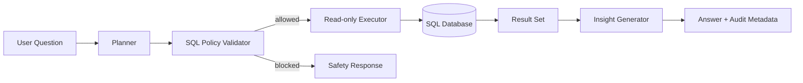

# 🔐 Secure Data Copilot

A local **read-only analytics copilot** for relational data. The system is designed around a strict rule: an AI assistant may help reason over business data, but it must not silently gain write access to the database.

## Implemented

- schema introspection for SQLite
- read-only SQL policy engine
- multi-statement blocking
- row-limit enforcement
- query audit metadata
- typed query plans
- deterministic local planner baseline
- execution timing
- automatic numeric summaries
- FastAPI service
- tests
- Docker

## Architecture



## Why this project matters

Many "chat with your database" demos give a model a database connection and hope for the best. This project instead separates **planning, policy, execution, observation and interpretation**.

The included planner is deterministic so the repository works offline and its tests are reproducible. A model-backed planner can later implement the same contract without weakening the safety boundary.

## Quick start

```bash
python -m venv .venv
source .venv/bin/activate
pip install -e ".[dev]"
python examples/bootstrap_demo.py
export COPILOT_DATABASE_PATH=examples/demo.db
uvicorn data_copilot.api:app --reload
```

Open `http://localhost:8000/docs`.

## Example

```json
{
  "question": "show the top customers by revenue"
}
```

## Security model

Only `SELECT` and `WITH ... SELECT` queries are accepted. Write, DDL, privileged, multi-statement and oversized queries are blocked before execution. SQLite is also opened in native read-only mode.

This is defense in depth, not a claim that string-level validation is a complete SQL sandbox. A production PostgreSQL version should combine AST validation with a dedicated least-privilege database role.

## Roadmap

- structured LLM planner adapter
- PostgreSQL adapter
- SQL AST validation with sqlglot
- semantic business metrics layer
- row/column-level authorization
- chart specifications
- query-result caching
- OpenTelemetry traces

## Scope and limitations

SQL policy is conservative lexical filtering, not a complete SQL parser. SQLite read-only/query-only modes provide an additional mutation boundary; query progress has a two-second deadline, not a full memory sandbox. The API uses only the server-configured database path. It has no authentication or row/column authorization and must remain local or behind an access-controlled gateway. Planner templates target a small demo schema, not arbitrary business reasoning. Query audit metadata is returned; the optional JSONL audit utility is not wired into the request path.

## Installation and development

Requires Python 3.12 or newer. Run from this project directory.

```bash
python -m venv .venv
source .venv/bin/activate
python -m pip install -e ".[dev]"
python -m ruff check .
python -m pytest -q
python -m pip wheel --no-deps . -w dist
```

On Windows, activate with `.venv\Scripts\Activate.ps1`.

## Library usage

```python
from data_copilot import DataCopilot
result = DataCopilot("examples/demo.db", max_rows=20).ask("top customers by revenue")
print(result.rows)
print(result.audit)
```

Run `python examples/bootstrap_demo.py` first to create the synthetic database.

## Configuration

See [.env.example](.env.example). Export variables into the process environment; the application does not automatically load that file. Keep real credentials out of Git.

## Service and API schema

```bash
python -m uvicorn data_copilot.api:app --host 127.0.0.1 --port 8000
```

Interactive endpoint schemas are at `http://127.0.0.1:8000/docs`; machine-readable schemas are at `/openapi.json`. These APIs have no built-in authentication. Use trusted local data and local access.

## Container

```bash
docker build -t secure-data-copilot .
docker run --rm -p 127.0.0.1:8000:8000 secure-data-copilot
```

The service returns 503 until a database is configured. Mount a synthetic database read-only and set `COPILOT_DATABASE_PATH` to its container path, for example `-v "$PWD/examples/demo.db:/data/demo.db:ro" -e COPILOT_DATABASE_PATH=/data/demo.db`.

## Repository structure

| Path | Purpose |
| --- | --- |
| `src/data_copilot/` | Implementation |
| `tests/` | Offline unit and regression tests |
| `docs/DESIGN.md` | Architecture and trust boundaries |
| `.github/workflows/ci.yml` | Install, lint, tests, wheel and container build |
| `pyproject.toml` | Dependencies and package configuration |

## Next engineering work

AST-based validation; database roles and row/column authorization; authenticated dataset selection; persistent audit wiring; PostgreSQL adapter. These are planned work, not current capabilities.

## Contributing and security

See [CONTRIBUTING.md](CONTRIBUTING.md) and [SECURITY.md](SECURITY.md). The standalone CI workflow runs after migration; while nested in the profile repository, the parent CI validates this project.

## License and provenance

[MIT](LICENSE), copyright 2026 Maharshi Patel. This public portfolio implementation is independent of employer systems and contains no confidential employer code or data. Examples and test fixtures are synthetic.
