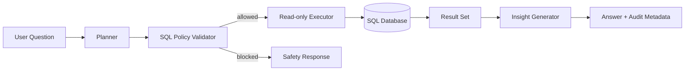

# 🔐 Secure Data Copilot

**A MAK'MA Studio Product · MAK'MA Labs**

[Live Product Demo](https://maharshimak.github.io/makma-ai-os/projects/secure-data-copilot/) · [MAK'MA Labs](https://maharshimak.github.io/makma-ai-os/projects/)

A local **read-only analytics copilot** for relational data. The system is designed around a strict rule: an AI assistant may help reason over business data, but it must not silently gain write access to the database.


## Product contract — engineering upgrade

**Problem and audience:** A safe local analytics workspace for engineers inspecting how questions become bounded business-data queries.

**Live tool:** https://maharshimak.github.io/makma-ai-os/projects/secure-data-copilot/

**Implemented browser workflow:** Editable synthetic customers/orders, supported natural-language question templates, schema privacy findings with reasons, read-only query inspection, risk budget, computed rows/statistics and CSV/JSON export. Mutation intent is rejected before planning.

**Backend and parity contract:** Browser executes a structured deterministic local query plan, NOT the displayed SQL. Python parses SQLite SQL with `sqlglot`, requires exactly one read-only query expression, rejects forbidden AST operations/functions, wraps the result with an outer row limit, and executes through a native read-only/query-only SQLite connection. The planner remains deterministic and returns confidence=None because its rules do not produce calibrated probabilities. CSV cells beginning with formula characters are neutralized.

**Architecture:** `makma-ai-os/demo` is the shared web product source and Pages deployment. This repository owns its Python domain package. The central `tests/e2e` suite exercises all nine products; `tests/fixtures/python-parity.json` plus `scripts/generate_parity.py` guard shared mathematical contracts. Backend revisions used for regeneration are pinned in the central `backend-lock.json`.

**Safety and limitations:** The browser remains a deterministic four-family demo. The Python backend also supports an optional OpenAI-compatible schema-aware planner, but every proposed statement is treated as untrusted and must pass table/column authorization, structural query-complexity limits, a query-risk budget, the parsed SQL AST policy, and the native read-only SQLite boundary before execution. Browser permits at most 1000 customers and 10000 orders. Bearer authentication exists for remote API access; true multi-user identity/session ownership and database row-level security are not implemented. Inputs are validated, rendered user values are escaped, and deterministic results are not presented as model inference.

**Verification:** Run `python -m ruff check .` and `python -m pytest -q`. `tests/test_engineering_upgrade.py` protects the new rejection/correctness paths. Central web checks: `npm ci`, `npm test`, `npm run build`, `npx playwright install --with-deps chromium`, `npm run test:e2e`. CI gates publishing on browser interactions and validates all public URLs after deployment.

**Highest-value next work:** Row-level authorization, persistent audit storage, database-native cost estimation and a production PostgreSQL least-privilege adapter.

**Provenance:** Independent MAK’MA Studio engineering implementation; examples are synthetic and no employer code or data is included. Existing MIT license applies.


## Implemented

- schema introspection for SQLite
- parsed read-only SQL AST policy engine using `sqlglot`
- multi-statement blocking
- row-limit enforcement
- query audit metadata including enforced risk and complexity scores\n- optional durable JSONL audit persistence wired into the API execution path
- typed query plans
- deterministic local planner baseline
- optional OpenAI-compatible schema-aware planner behind the same AST/read-only execution boundary
- execution timing
- automatic numeric summaries
- FastAPI service
- tests
- Docker

## Architecture


```mermaid
flowchart LR
U[User Question] --> P[Planner]
P --> V[SQL Policy Validator]
V -->|allowed| E[Read-only Executor]
V -->|blocked| B[Safety Response]
E --> D[(SQL Database)]
D --> R[Result Set]
R --> I[Insight Generator]
I --> A[Answer + Audit Metadata]
```

## Why this project matters

Many "chat with your database" demos give a model a database connection and hope for the best. This project instead separates **planning, policy, execution, observation and interpretation**.

The included planner is deterministic so the repository works offline and its tests are reproducible. A model-backed planner can later implement the same contract without weakening the safety boundary.

## Quick start

```bash
python -m venv .venv
source .venv/bin/activate
pip install -e ".[dev]"
python examples/bootstrap_demo.py
export COPILOT_DATABASE_PATH=examples/demo.db
uvicorn data_copilot.api:app --reload
```

Open `http://localhost:8000/docs`.

## Example

```json
{
  "question": "show the top customers by revenue"
}
```

## Security model

Only `SELECT` and `WITH ... SELECT` queries are accepted. Write, DDL, privileged, multi-statement and oversized queries are blocked before execution. Allowed queries are additionally checked against structural complexity and risk budgets before SQLite is reached. SQLite is opened in native read-only/query-only mode.

This is defense in depth, not a claim that AST validation alone is a complete SQL sandbox. The parser boundary is combined with SQLite native read-only/query-only mode, a progress deadline and a bounded outer result. A production PostgreSQL version should additionally use a dedicated least-privilege database role and row/column authorization.

## Roadmap

- PostgreSQL adapter
- semantic business metrics layer
- row/column-level authorization
- chart specifications
- query-result caching
- OpenTelemetry traces

## Scope and limitations

SQL policy is parsed with `sqlglot` and rejects non-query statements, forbidden administrative/write nodes and dangerous SQLite file/extension functions. SQLite read-only/query-only modes provide an additional mutation boundary; query progress has a two-second deadline, not a full memory sandbox. The API uses only the server-configured database path. It is local-only by default and supports bearer-authenticated remote access. Optional table/column authorization can restrict the schema visible to a model-backed planner and is re-checked against the generated SQL before execution; true user/role identity, row-level security and multi-tenant ownership remain future work. Planner templates still target a small demo schema rather than arbitrary business reasoning. Query audit metadata is returned and can be durably persisted as JSONL by setting `COPILOT_AUDIT_LOG_PATH`; each successful query then returns the persisted `event_id`.

## Installation and development

Requires Python 3.12 or newer. Run from this project directory.

```bash
python -m venv .venv
source .venv/bin/activate
python -m pip install -e ".[dev]"
python -m ruff check .
python -m pytest -q
python -m pip wheel --no-deps . -w dist
```

On Windows, activate with `.venv\Scripts\Activate.ps1`.

## Library usage

```python
from data_copilot import DataCopilot
result = DataCopilot("examples/demo.db", max_rows=20).ask("top customers by revenue")
print(result.rows)
print(result.audit)
```

Run `python examples/bootstrap_demo.py` first to create the synthetic database.

## Configuration

See [.env.example](.env.example). Export variables into the process environment; the application does not automatically load that file. Keep real credentials out of Git.

## Service and API schema

```bash
python -m uvicorn data_copilot.api:app --host 127.0.0.1 --port 8000
```

Interactive endpoint schemas are at `http://127.0.0.1:8000/docs`; machine-readable schemas are at `/openapi.json`. The API is local-only by default. Set `COPILOT_API_TOKEN` to enable bearer-authenticated remote access. Set `COPILOT_MODEL_BASE_URL` and `COPILOT_MODEL` together to activate the guarded OpenAI-compatible planner; generated SQL still passes through the same AST policy and query-only database boundary.

## Container

```bash
docker build -t secure-data-copilot .
docker run --rm -p 127.0.0.1:8000:8000 secure-data-copilot
```

The service returns 503 until a database is configured. Mount a synthetic database read-only and set `COPILOT_DATABASE_PATH` to its container path, for example `-v "$PWD/examples/demo.db:/data/demo.db:ro" -e COPILOT_DATABASE_PATH=/data/demo.db`.

## Repository structure

| Path | Purpose |
| --- | --- |
| `src/data_copilot/` | Implementation |
| `tests/` | Offline unit and regression tests |
| `docs/DESIGN.md` | Architecture and trust boundaries |
| `.github/workflows/ci.yml` | Install, lint, tests, wheel and container build |
| `pyproject.toml` | Dependencies and package configuration |

## Next engineering work

Database roles and row-level authorization; authenticated dataset selection; PostgreSQL adapter; database-native query-cost estimation. These are planned work, not current capabilities.

## Contributing and security

See [CONTRIBUTING.md](CONTRIBUTING.md) and [SECURITY.md](SECURITY.md). CI runs on every push and pull request through `.github/workflows/ci.yml`.

## License and provenance

[MIT](LICENSE), copyright 2026 Maharshi Patel. This public portfolio implementation is independent of employer systems and contains no confidential employer code or data. Examples and test fixtures are synthetic.
